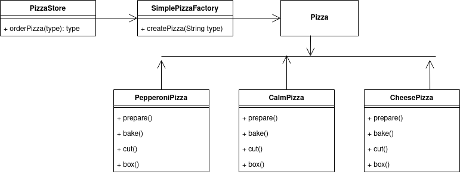

# Factory Method Pattern
A Factory Pattern or Factory Method Pattern says that just define an interface or abstract class for creating an object
but let the subclasses decide which class to instantiate. In other words, subclasses are responsible to create the instance of the class.

# Let's we have a **pizza** store

```java
public class PizzaStore{
  
  Pizza orderPizza(){
    Pizza pizza = new Pizza();
    
        pizza.prepare();
        pizza.bake();
        pizza.cut();
        pizza.box();
  }
}
```

But when we need more than one type **Pizza** ? Then we have to modify our **PizzaStore**

```java
public class PizzaStore{
  
  Pizza orderPizza(String type){
    Pizza pizza;
    
    if(type.equalsIgnoreCase("cheese")){
        pizza = new CheesePizza();
    }else if(type.equalsIgnoreCase("pepperoni")){
        pizza = new PepperoniPizza();
    }else if(type.equalsIgnoreCase("calm")){
        pizza = new CheesePizza();
    }
    
    pizza.prepare();
    pizza.bake();
    pizza.cut();
    pizza.box();
  }
}
```
<h3>
Clearly, dealing with which concrete class is instantiated is really messing up
our orderPizza() method and preventing it from being closed for
modification. But now that we know what is varying and what isn’t, it’s
probably time to encapsulate it.
  </h3>
  
  # Encapsulating object creation
  <h3> Building a simple pizza factory </h3>
  
  ```java
  
  public class SimplePizzaFactory {
    public Pizza createPizza(String type){
        Pizza pizza = null;

        if(type.equalsIgnoreCase("cheese")){
            pizza = new CheesePizza();
        }else if(type.equalsIgnoreCase("pepperoni"))
        {
            pizza = new PepperoniPizza();
        }else if(type.equalsIgnoreCase("calm")){
            pizza = new CheesePizza();
        }

        return pizza;
    }
}
  
  ```
  
  <h2>Now, our new PizzaStore will be </h2>
  
  ```java
  
  public class PizzaStore {
    SimplePizzaFactory factory;

    public PizzaStore(SimplePizzaFactory factory){
        this.factory = factory;
    }

    public Pizza orderPizza(String type)
    {
        Pizza pizza;
        pizza = factory.createPizza(type);

        pizza.prepare();
        pizza.bake();
        pizza.cut();
        pizza.box();

        return pizza;
    }
}
  
  ```
  
  # Let's create a Driver class
  
  ```java
  
  public class Demo {
    public static void main(String[] args) {
        SimplePizzaFactory factory = new SimplePizzaFactory();
        PizzaStore pizzaStore = new PizzaStore(factory);
        pizzaStore.orderPizza("cheese");
    }
}
  
  ```
  
  Here **Pizza** is an Interface **CheesePizza**, **CalmPizza** and **PepperoniPizza** implemented this **Pizza** interface. (See code for better underesting)
  # UML Diagram
  
