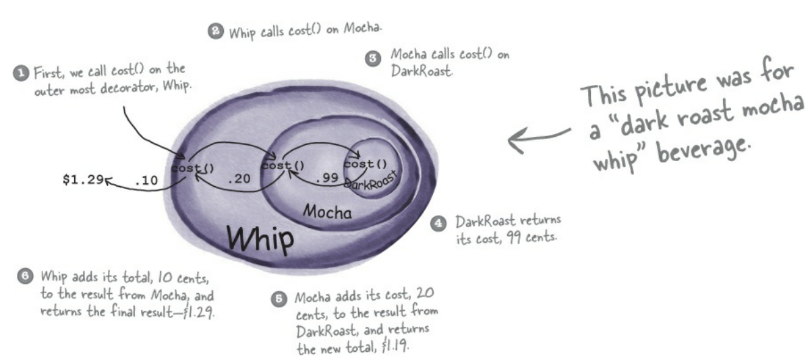

# Decorator Pattern

**Decorator Pattern** একজন ইউজারকে একটি অবজেক্টের স্টাকচার পরিবর্তন না করেই নতুন নতুন **functionality** যোগ করার পারমিশন দেয় ।
Decorator pattern allows a user to add new functionality to an existing object without altering its structure.

# একটু ঝামেলা মনে হচ্ছে ?

চলুন একটা উদাহরণ দিয়ে ব্যপারটা পরিষ্কার করা যাক, আমরা পেয়াজের কথাই ধরতে পারি । মুল পেয়াজের (যেটি আমরা তরকারিতে ব্যবহার করি) উপর স্তরে স্তরে যে খোসা থাকে এই প্রত্যেকটি স্তরকে
আমরা এক একটি নতুন নতুন **ফিচার** ভাবতে পারি । এই খোসার স্তর কিন্তু পেয়াজের স্টাকচারকে পরিবর্তন করেনি।

# চলুন আমরা একটা কফি সপ দিয়ে ফেলি

<h3> কিন্তু কফির দাম কিভাবে নির্ধারণ করবো ?</h3>
এইটাতো একদন সোজা প্রত্যেক কফির একটা দাম ফিক্সড করে দিলেইতো হছে !!! 
<h3> কিন্তু আমাদের কফি সপে ইচ্ছে মতো ফ্লেবার এড করা যায় । এখন প্রত্যেক নতুন নতুন ফ্লেবারের জন্য তো কিন্তু প্রাইস এড করতে হবে  ! একন কি করবো ?</h3>

এখনো বেশী ঝামেলার কিছুতো মনে হচ্ছে না! প্রত্যেকবার এক একটা নতুন ফ্লেবারের জন্য মুল কফির সাথে ফ্লেবারের কষ্ট যোগ করে দিলেই ঝামেলা শেষ !!!

# চলুন একটু ভিজুয়ালাইজ করে ফেলি


এখানে আমাদের মুল কফি হচ্ছে **DarkRoast** এটার উপর দুটো ফ্লেবার যোগ করা হয়েছে । প্রথমে **DarkRoast** এর উপর **Mocha** যোগ করা হয়েছে এবং তারপর **Whip** যোগ করা হয়েছে। এবং কফির দাম নির্ধারণের ক্ষেত্রে প্রথমে **DarkRoast** এর সাথে **Mocha** এর দাম যোগ করা হয়েছে, যোগ করার পর যে দাম পাওয়া গেছে তার সাথে **Whip** এর দম যোগ করা হয়েছে ।

<h2> আশা করি আপনাদের ধারনা ক্লিয়ার হয়েছে </h2>

# চলুন এবার ইমপ্লিমেন্টেশনে যাওয়া যাক

এখন আমাদের কফি সপেতো আমরা জাস্ট একধরনের কফি বিক্রি করবোনা, অনেক ধরনের কফি থাকতে পারে । এবং তাদের দাম ও এক এক কফির এক এক রকম হবে । তাহলে আমরা **Beverage** নামের একটি **Abstract** ক্লাস তৈরি করে ফেলি । এখন আপনার মনে প্রশ্ন জাগতেই পারে **Abstract** ক্লাস কেন ? এর উত্তর হচ্ছে এক এক কফির দাম এক এক ভাবে ক্যালকুলেশন করা হবে, প্রত্যেকের দামতো আর এক হবেনা আর এক ভাবেও ক্যালকুলেশন করা হবেনা । এইজন্য আমরা **cost** মেথডটিকে **abstract** করলাম এখন প্রত্যেক ধরনের কফি এটাকে ইমপ্লিমেন্ট করে নিজেদের মতো দাম ক্যালকুলেশন করবে ।

```java

public abstract class Beverage {
    String description = "Unknown Beverage";

    public String getDescription(){
        return description;
    }

    public abstract double cost();
}

```

# প্রথমে আমরা জাস্ট **DarkRoast**, **Espresso** এবং **HouseBlend** কফি বিক্রি করবো

```java

public class DarkRoast extends Beverage {
    public DarkRoast() {
        description = "Dark Roast Coffee";
    }

    public double cost() {
        return .99;
    }
}

```

```java

public class HouseBlend extends Beverage{
    public HouseBlend() {
        description = "House Blend Coffee";
    }

    @Override
    public double cost() {
        return 0.89;
    }
}

```

```java

public class Espresso extends Beverage{

    public Espresso() {
        description = "Espresso";
    }

    @Override
    public double cost() {
        return 1.99;
    }
}

```

# এবার ফ্লেবারে আসা যাক

```java
public abstract class CondimentDecorator extends Beverage{
    Beverage beverage;
    public abstract String getDescription();
}
```

<p>আমরা কেন **Beverage** ক্লাসকে **extend** করলাম ?</p>
কারণ, আমরা **Beverage** এর স্টাকচার পরিবর্তন না করেই, তার উপর লেয়ার এড করতে চাই। আমাদের যেহেতু অনেক ধরনের ফ্লেবার থাকবে পারে তাই আমরা এখনেও **getDescription** কে **abstract** রাখলাম এবং **Beverage** কে extend করে যে abstract **cost** মেথড পেলাম তাকেও ইমপ্লিমেন্ট করলাম না, এক এক ধরনের ফ্লেবার **CondimentDecorator** ক্লাসকে extend করে এগুলো নিজেকের মতো ইমপ্লিমেন্ট করে নিবে।

```java
public class Mocha extends CondimentDecorator {
    public Mocha(Beverage beverage) {
        this.beverage = beverage;
    }

    public String getDescription() {
        return beverage.getDescription() + ", Mocha";
    }

    public double cost() {
        return .20 + beverage.cost();
    }
}
```

```java
public class Soy extends CondimentDecorator {
	public Soy(Beverage beverage) {
		this.beverage = beverage;
	}

	public String getDescription() {
		return beverage.getDescription() + ", Soy";
	}

	public double cost() {
		return .15 + beverage.cost();
	}
}
```

```java
public class Whip extends CondimentDecorator {
	public Whip(Beverage beverage) {
		this.beverage = beverage;
	}

	public String getDescription() {
		return beverage.getDescription() + ", Whip";
	}

	public double cost() {
		return .10 + beverage.cost();
	}
}
```

# ঝামেলা শেষ !!! চলুন এবার কফি বাননো যাক

```java
public class StarbuzzCoffee {

    public static void main(String args[]) {
        Beverage beverage = new Espresso();
        System.out.println(beverage.getDescription()
                + " $" + beverage.cost());

        Beverage beverage2 = new DarkRoast();
        beverage2 = new Mocha(beverage2);
        beverage2 = new Mocha(beverage2);
        beverage2 = new Whip(beverage2);
        System.out.println(beverage2.getDescription()
                + " $" + beverage2.cost());

        Beverage beverage3 = new HouseBlend();
        beverage3 = new Soy(beverage3);
        beverage3 = new Mocha(beverage3);
        beverage3 = new Whip(beverage3);
        System.out.println(beverage3.getDescription()
                + " $" + beverage3.cost());
    }
}
```

# আউটপুট

```
Espresso $1.99
Dark Roast Coffee, Mocha, Mocha, Whip $1.49
House Blend Coffee, Soy, Mocha, Whip $1.34
```
