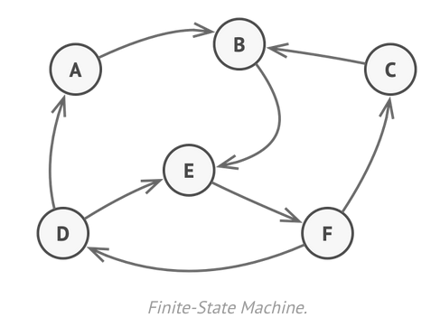

# State Pattern

কোন একটি অবজেক্টের ইন্টারনাল স্টেজ বা স্টেট পরিবর্তন হলে অবজেক্টের আচরণ অর্থাৎ কাজ বদলে ফেলা ।

**allow the object for changing its behavior without changing its class.**

# আসুন আর একটু ভালো ভাবে বুঝা যাক

যেমন ট্রাফিক সিগন্যালের কথা ধরা যাক , যখন গ্রিন লাইট জ্বলে থাকে তখন সকল ড্রাইবার বুঝতে পারে এখন তাদের পথ চলতে নিষেধ নেই । যখন গ্রিন লাইট চেঞ্জ হয়ে ইয়োলো লাইট জ্বলে তখন ড্রাইবাররা সতর্ক হয়, কারণ অল্প সময়ের মধ্যে রেড লাইট অন হয়ে যাবে অর্থাৎ সাময়িক সময়ের জন্য যান চলাচল বন্ধ রাখতে হবে অন্য রুটের গাড়ি যেতে দেওয়ার জন্য । যখন রেড লাইট জ্বলে যায় তখন আমাদের থেমে অপেক্ষা করতে হয় চলাচলের অনুমতির জন্য অর্থাৎ গ্রিন লাইট জ্বলার অপেক্ষা করতে হয় । এখানে প্রত্যেক বার ভিন্ন ভিন্ন লাইট জ্বলার সাথে সাথে কিন্তু আমাদের ট্রাফিক সিগন্যাল সিস্টেমের স্টেট বদলে যায় এবং ড্রাইবারদের আচরণ ও বদলে যায় অর্থাৎ আমাদের সিস্টেম ভিন্ন আচরণ করে । এখানে **গ্রিন লাইট** , **ইয়োলো লাইট** এবং **রেড লাইট** এক একটি স্টেট 

# State Pattern কিন্তু ফাইনাইট স্টেট মেশিনের মতোই কাজ করে !!!



আমরা কিন্তু 2nd ইয়ারে **Theory of computation** course এ <a href="https://flaviocopes.com/finite-state-machines/">ফাইনাইট স্টেট মেশিন</a> পড়ে এসেছি।

# ইমপ্লিমেন্টেশন

```java
public interface State {
    public void onGreenLight();
    public void onYellowLight();
    public void onRedLight();
}
```

```java
public class GreenLight implements State{
    TrafficSystem trafficSystem;

    public GreenLight(TrafficSystem trafficSystem) {
        this.trafficSystem = trafficSystem;
    }

    @Override
    public void onGreenLight() {
        System.out.println("Moving...");
    }

    @Override
    public void onYellowLight() {
        System.out.println("Move carefully...");
        trafficSystem.setState(trafficSystem.getYellowState());
    }

    @Override
    public void onRedLight() {
        System.out.println("Can't go from Green to Red");
    }
}
    // other method
```

```java
public class YellowLight implements State{
    TrafficSystem trafficSystem;

    public YellowLight(TrafficSystem trafficSystem) {
        this.trafficSystem = trafficSystem;
    }

    @Override
    public void onGreenLight() {
        System.out.println("Can't go to Green from yellow");
    }

    @Override
    public void onYellowLight() {
        System.out.println("Yellow light already on");
    }

    @Override
    public void onRedLight() {
        System.out.println("Turning on red light...");
        trafficSystem.setState(trafficSystem.getRedState());
    }

    // other method
}
```

```java
public class RedLight implements State{
    TrafficSystem trafficSystem;

    public RedLight(TrafficSystem trafficSystem) {
        this.trafficSystem = trafficSystem;
    }

    @Override
    public void onGreenLight() {
        System.out.println("Going back to green...");
        trafficSystem.setState(trafficSystem.getGreenState());
    }

    @Override
    public void onYellowLight() {
        System.out.println("Can't go to yellow from red");
    }

    @Override
    public void onRedLight() {
        System.out.println("Red signal already on...");
    }
}
```

```java
public class TrafficSystem {
    State green;
    State yellow;
    State red;

    State state;

    public TrafficSystem()
    {
        green = new GreenLight(this);
        yellow = new YellowLight(this);
        red = new RedLight(this);

        state = green;
    }

    public void turnOnGreenLight(){
        state.onGreenLight();
    }

    public void turnOnYellowLight(){
        state.onYellowLight();
    }

    public void turnOnRedLight(){
        state.onRedLight();
    }

    void setState(State state){
        this.state = state;
    }

    public State getGreenState(){
        return green ;
    }

    public State getYellowState(){
        return yellow;
    }
    public State getRedState(){
        return red;
    }
}
```

# চলুন এবার কোড রান করে দেখা যাক

```java
public class TestTrafficSignal {
    public static void main(String[] args) {
        TrafficSystem trafficSystem = new TrafficSystem();

        trafficSystem.turnOnGreenLight();
        trafficSystem.turnOnRedLight();

        trafficSystem.turnOnYellowLight();
        trafficSystem.turnOnGreenLight();

        trafficSystem.turnOnRedLight();
        trafficSystem.turnOnYellowLight();
        trafficSystem.turnOnGreenLight();
    }
}
```

# আউটপুট

```
Moving...
Can't go from Green to Red
Move carefully...
Can't go to Green from yellow
Turning on red light...
Can't go to yellow from red
Going back to green...
```
