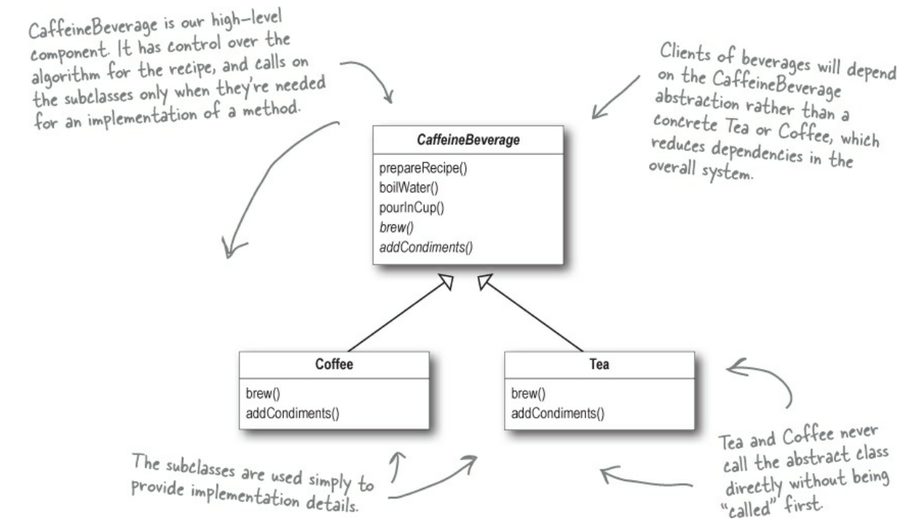

# Template Pattern

**Template Pattern** ফাংশনের কাঠামো তৈরি করে এবং সাব -ক্লাসকে এই ফাংশনের কাঠামো পরিবর্তন না করে কাজ কেমন হবে বা কিভাবে কাজ করবে তা নির্ধারণ করার সুযোগ দেয় ।

The Template Method Pattern defines the skeleton of an algorithm in a method,
deferring some steps to subclasses. Template Method lets subclasses redefine certain
steps of an algorithm without changing the algorithm’s structure.

# অনেক পড়া লেখা হইছে, এখন একটু ক্যাফেইন দরকার

আপনি আর আপনার বন্ধু ভার্সিটির লাল টঙ্গে গিয়ে মামাকে বললেন মামা একটা চা আর একটা কফি দেন(যদিও লাল টঙ্গে কফি পাওয়া যায় না)। মামা সাথে সাথে চা এবং কফি বানানো শুরু করলো...

# কফি

```java
    public class Coffee{
        void prepareRecipe(){
            boilWater();
            brewCoffeeGrinds();
            pourInCup();
            addSugarAndMilk();
        }

        public void boilWater(){
            System.out.println("Boiling Water...");
        }

        public void brewCoffeeGrinds(){
            System.out.println("Dripping coffee through filter...");
        }

        public void pourInCup(){
             System.out.println("Pouring into cup...");
        }

        public void addSugarAndMilk(){
             System.out.println("Adding Sugar and Milk...");
        }
    }
```

# চা

```java
    public class Tea{
        void prepareRecipe(){
            boilWater();
            steepTeaBag();
            pourInCup();
            addLemon();
        }

        public void boilWater(){
            System.out.println("Boiling Water...");
        }

        public void steepTeaBag(){
            System.out.println("Steeping the tea...");
        }

        public void pourInCup(){
             System.out.println("Pouring into cup...");
        }

        public void addLemon(){
             System.out.println("Adding lemon ...");
        }
    }
```

<h1>মামা, এতো কোড ডুপ্লিকেশন কেন ? </h1>
<ul>
<li> কফি brewing আর চা steeping এর মধ্যেতো তেমন কোন পার্থক্য নাই । </li>
<li>কফিতে দুধ এবং চিনি দেওয়া আর চাতে লেবু দেওয়া তো একইরকম কাজ । </li>
</ul>

# চলেন ডুপ্লিকেশন কমাই

```java
public abstract class CaffeineBeverage {
    final void prepareRecipe(){
        boilWater();
        brew();
        pourIncup();
        addCondiments();
    }

    abstract void brew();
    abstract void addCondiments();

    void boilWater(){
        System.out.println("Boiling water...");
    }

    void pourIncup(){
        System.out.println("Pouring into cup...");
    }
}
```

<h2>এখানে CaffeineBeverage কিন্তু আপনাকে brew এবং addCondiments মেথডকে আপনার ইচ্ছে মতো ডিফাইন করতে দিচ্ছে </h2>
# ক্লাস ডায়াগ্রাম


# নতুন কফি

```java
public class Coffee extends CaffeineBeverage{
    @Override
    void brew() {
        System.out.println("Dripping Coffee through filter...");
    }

    @Override
    void addCondiments() {
        System.out.println("Adding sugar and milk");
    }
}
```

# নতুন চা

```java
public class Tea extends CaffeineBeverage{
    @Override
    void brew() {
        System.out.println("Stepping the tea...");
    }

    @Override
    void addCondiments() {
        System.out.println("Adding lemon...");
    }
}
```

<h2>Tea এবং Coffee ক্লাস কিন্তু সুপার ক্লাস CaffeineBeverage এর brew এবং addCondiments এর কাঠামো পরিবর্তন না করেই এর কাজ ডিফাইন করে দিয়েছে। </h2>

# চলেন কোড রান করি

```java
public class CaffeineHouse {
    public static void main(String[] args) {
        Tea tea = new Tea();
        System.out.println("---------making tea------------");
        tea.prepareRecipe();
        Coffee coffee = new Coffee();
        System.out.println("---------making coffee------------");
        coffee.prepareRecipe();
    }
}
```

# আউটপুট

```
---------making tea------------
Boiling water...
Stepping the tea...
Pouring into cup...
Adding lemon...
---------making coffee------------
Boiling water...
Dripping Coffee through filter...
Pouring into cup...
Adding sugar and milk
```
